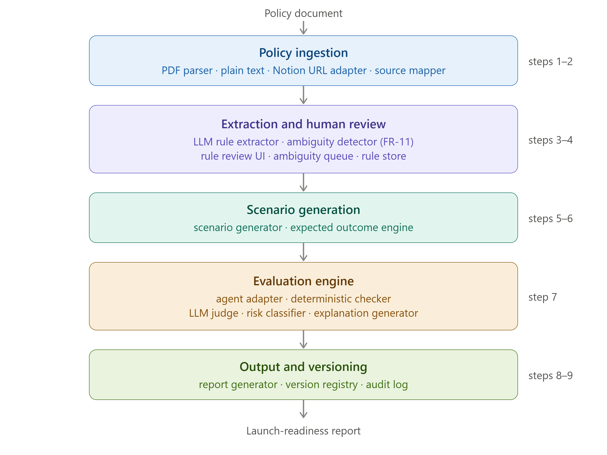
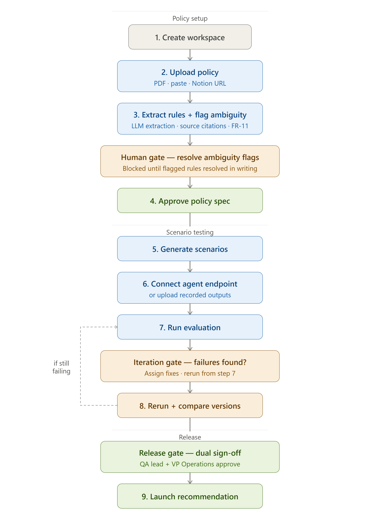

  <h1>PolicyLens AI</h1>

  
<strong>Pre-production policy compliance testing for AI agents.</strong>

  

    
    
    
    
    
    
  

---

## What is PolicyLens AI?

Teams deploying AI agents test for capability — does the agent answer correctly? — but not always for compliance — does it follow our specific policy?

The gap is subtle: an agent can give plausible, confident answers that are still wrong under an organization's rules.

**PolicyLens extracts structured rules from policy documents, generates test scenarios, evaluates the agent against each approved, testable rule, and produces a launch-readiness report with dual sign-off before production approval.**

> **Upload your policy. Generate tests. Evaluate your agent. Ship with confidence.**

---

## How It Works

### Pipeline architecture

### User flow

---

## Key Features

- 📄 **Structured Rule Extraction** — Claude parses policy documents into typed IF/THEN rules with condition, action, exception, and severity
- 🚩 **Ambiguity Flagging** — rules whose correct action depends on unstated context are flagged and block testing until resolved by a human
- 🧪 **Scenario Generation** — normal, edge, and adversarial test cases generated per rule, covering policy edge cases and combinations that basic happy-path QA may miss
- ⚖️ **Dual Evaluation Engine** — deterministic keyword matching for clear-cut cases, LLM judge fires only for inconclusive or critical results
- 📋 **Launch-Readiness Report** — Ready / Conditionally Ready / Not Ready verdict with violation breakdown by severity
- ✍️ **Dual Sign-Off** — two stakeholders must sign before a release is approved; same signer cannot sign twice, enforced at the service layer
- 🔐 **Clerk Auth** — all routes JWT-protected; authenticated and architected for tenant-scoped data access

---

## Policy Violations Identified in Testing

During a controlled e-commerce returns-policy simulation, PolicyLens identified several agent responses that violated the expected policy outcome despite sounding reasonable on the surface.

| Scenario | Agent action | Expected policy action |
|----------|-------------|------------------------|
| Final-sale damaged item | Cash refund approved | Store credit only |
| Apple product holiday return | January 31 deadline applied | January 15 deadline |
| Marketplace item return | Direct refund processed | Route to seller first |
| Loyalty-points purchase | Full refund issued as cash | Proportional refund split |

These scenarios represent policy edge cases that basic happy-path QA can easily miss. At scale, errors like these could create customer, financial, and operational risk.

> **Evaluation note:** These findings came from a small, manually designed simulation. They demonstrate the workflow and types of policy risks PolicyLens is intended to detect; they do not represent production model accuracy or statistically validated performance.

---

## Tech Stack

**Backend** — FastAPI · SQLAlchemy 2.0 async · PostgreSQL 16 · Anthropic Claude API · Python 3.12

**Frontend** — Next.js 14 (App Router) · TypeScript · Clerk Auth

**Infrastructure** — Vercel · Render · Neon PostgreSQL · Docker Compose

---

## Design Decisions

**Deterministic evaluation first, LLM judge second.** Keyword pattern matching runs before any API call. The LLM judge only fires for inconclusive results or critical-tier scenarios — keeping evaluation fast and cost-bounded.

**Ambiguity flags block scenario generation.** If Claude identifies a rule whose correct action depends on unstated context, it raises an ambiguity flag. Testing cannot proceed until a human resolves it in plain language. Ambiguous rules produce unreliable scenarios.

**Expected actions are typed, not free-form.** Scenarios specify one of nine exact expected actions — `APPROVE_FULL_REFUND`, `APPROVE_STORE_CREDIT`, `DENY_RETURN`, `ROUTE_TO_SELLER`, etc. The distinction between these is exactly the class of violation PolicyLens is built to catch.

**Dual sign-off is enforced at the service layer.** A release requires exactly 2 signatures before status moves to approved. The same signer cannot sign twice. This is not a UI convention — it is a backend constraint.

---

## Research and Evaluation Context

PolicyLens AI was developed as an AI Product Management portfolio project using secondary research, structured persona simulations, and controlled policy-testing scenarios. The current implementation demonstrates product feasibility, AI evaluation design, and full-stack execution. It has not yet been validated with production customers, live enterprise agents, or confirmed design partners.

---

## Portfolio Context

PolicyLens AI is the first project in an AI operations portfolio. The second, [ExceptionLoop](https://github.com/rajendergugulothu/exceptionloop), manages what breaks after deployment.

| | PolicyLens AI | ExceptionLoop |
|--|--------------|---------------|
| **When** | Before deployment | After deployment |
| **What** | Tests agents against policy | Manages escalations + learns from them |
| **Output** | Launch-readiness report | Automation pipeline |
| **North Star** | % critical policy rules tested successfully before production | % recurring exceptions converted to automation |

---

## About

PolicyLens AI is a deployed, production-oriented portfolio MVP demonstrating:

- LLM-powered policy extraction
- Human-reviewed structured rules
- Ambiguity detection and human resolution
- Typed scenario generation
- Hybrid deterministic and LLM-based evaluation
- Severity-based release gating
- Dual sign-off enforced at the backend
- Authenticated full-stack deployment

The project was built to demonstrate how AI agents can be tested against organization-specific policies before receiving production authority.

**Built by [Rajender Gugulothu](https://github.com/rajendergugulothu)**

---

  <em>PolicyLens AI — Test your agent before your users do.</em>

